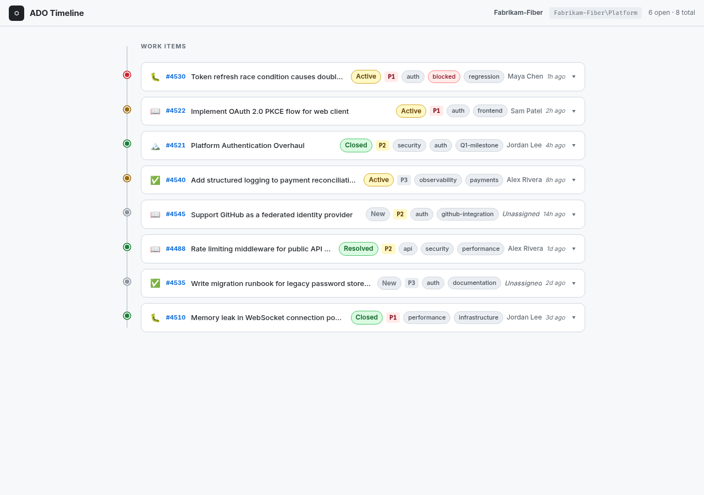

# ADO Timeline

A read-only dashboard that displays Azure DevOps work items as a vertical timeline with collapsible detail cards. Think of it as a quick situational-awareness view for a team's backlog — ordered by recency, colored by status, expandable for full context.



## Why

Boards and backlogs in Azure DevOps are great for planning, but they aren't optimized for _glancing_ at recent activity across an area path. ADO Timeline fills that gap: one vertical feed showing what changed, what's blocked, and what just shipped — without clicking through multiple views.

## How It Works

- Fetches work items from the Azure DevOps REST API, filtered by a single **area path**
- Displays both open and closed items on a vertical timeline, most-recently-changed first
- Each card shows the work item type, ID, title, state, priority, tags, assignee, and relative timestamp at a glance
- Click a card to expand it and see full details, activity (comments), and linked items (parent/child work items, pull requests)

### Status Dots

The colored dot on the timeline rail gives instant signal:

| Color | Meaning |
|-------|---------|
| 🟢 Green | Closed / Done / Resolved |
| 🟡 Yellow | Active / In Progress |
| 🔴 Red | Blocked (detected via tag or blocking link) |
| ⚪ Grey | New / Not Started |

### Expanded Card Sections

Cards expand into three scrollable sections (no tabs — everything visible at once):

- **Details** — description, acceptance criteria, iteration path, story points, area path
- **Activity** — comment thread with avatars and relative timestamps
- **Links** — related work items (parent/child/related) and linked pull requests with status

## Authentication

The app uses the Azure CLI for token acquisition — no PATs or secrets to manage:

```bash
az account get-access-token --resource 499b84ac-1321-427f-aa17-267ca6975798 --query accessToken -o tsv
```

You must have `az login` completed beforehand. The token is passed as a Bearer header to the ADO REST API.

## Configuration

Edit the `config` object at the top of `src/ui/app.js`:

```js
const config = {
  org: 'my-org',
  project: 'my-project',
  areaPath: 'MyProject\\MyTeam'
};
```

## Running Locally

No build step. Serve the `src/ui/` directory with any static file server:

```bash
cd src/ui
python3 -m http.server 8080
```

Then open [http://localhost:8080](http://localhost:8080).

## Tech Stack

- **Vanilla JavaScript** — no framework, no transpiler
- **CSS custom properties** — easy theming via variables
- **No build step** — single HTML + JS + CSS, served statically
- **Inter + Fira Code** — loaded from Google Fonts

## Current State

The UI is fully functional with **fake data** that mirrors real Azure DevOps REST API response shapes (field reference names, relation types, comment structure). Wiring up the live API is the next step.
